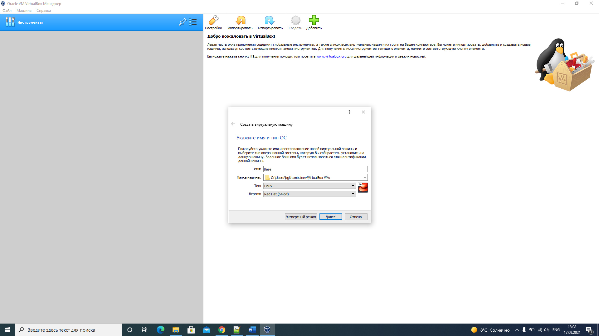
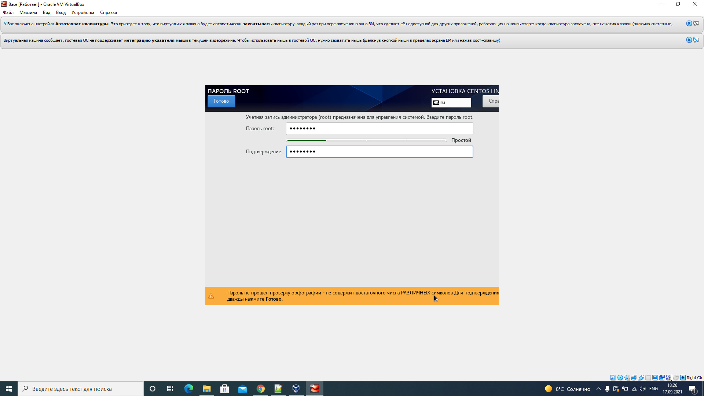
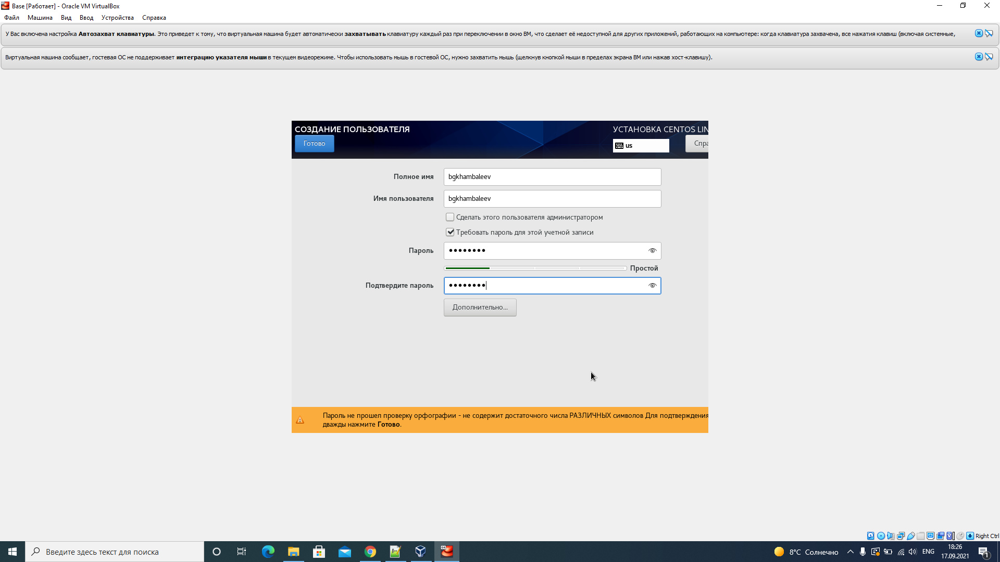
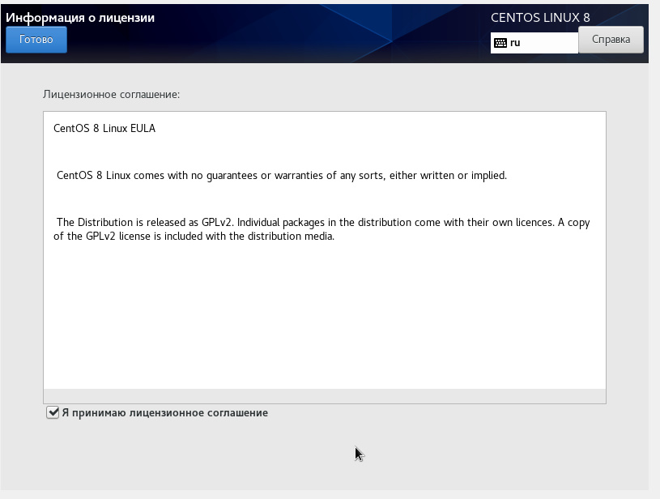
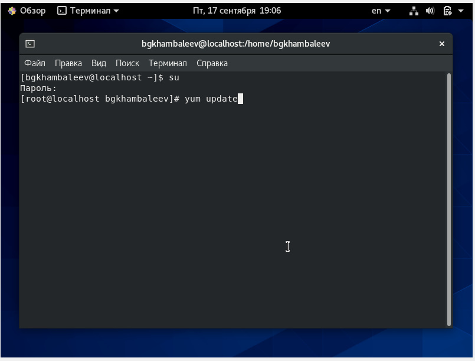
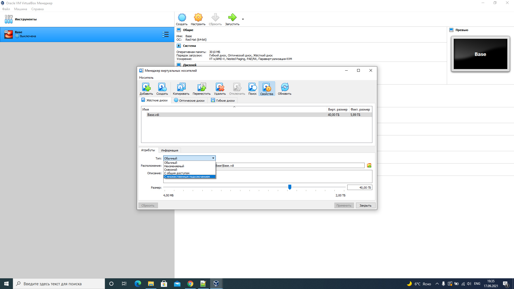

---
## Front matter
lang: ru-RU
title: Отчёт по лабораторной работе 1
author: 'Хамбалеев Булат Галимович'
date: 17 сентября, 2021

## Formatting
toc: false
slide_level: 2
theme: metropolis
mainfont: Ubuntu
romanfont: Ubuntu
sansfont: Ubuntu
monofont: Ubuntu
header-includes: 
 - \metroset{progressbar=frametitle,sectionpage=progressbar,numbering=fraction}
 - '\makeatletter'
 - '\beamer@ignorenonframefalse'
 - '\makeatother'
aspectratio: 43
section-titles: true
---

## Цель работы

Приобретение практических навыков установки операционной системы на виртуальную машину, настройки минимально необходимых для
дальнейшей работы сервисов.

## Задание

Лабораторная работа подразумевает установку на виртуальную машину VirtualBox операционной системы
Linux, дистрибутив Centos.

# Выполнение лабораторной работы

1. Открываю Oracle VirtualBox и создаю новую виртуальную машину с названием Base. В настройках для неё выделяю 3010 МБ оперативной памяти и 40 ГБ памяти на жёстком диске. Также в настройках указываю 
расположение образа диска Centos.

{ #fig:001 width=70% }

---

2. Далее я указываю свой язык, часовой пояс, настройки сети и самое главное: пароль для root.

{ #fig:002 width=70% }

---

3. Также необходимо создать пользователя.

{ #fig:003 width=70% }

---

4. После установки я принимаю условия лицензии.

{ #fig:004 width=70% }

---

5. Также после установки я обновляю системные файлы  и устанавливаю некоторые необходимые программы, такие как mc.

{ #fig:005 width=70% }

---

6. После этого я выключаю виртуальную машину и делаю возможным множественное подключение, то есть теперь на основе виртуальной машины Base можно создавать новые виртуальные машины.

{ #fig:006 width=70% }

---

## {.standout}

Спасибо за внимание
