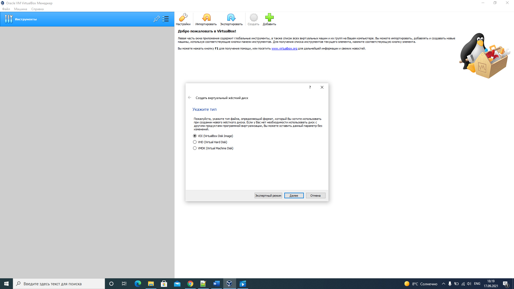
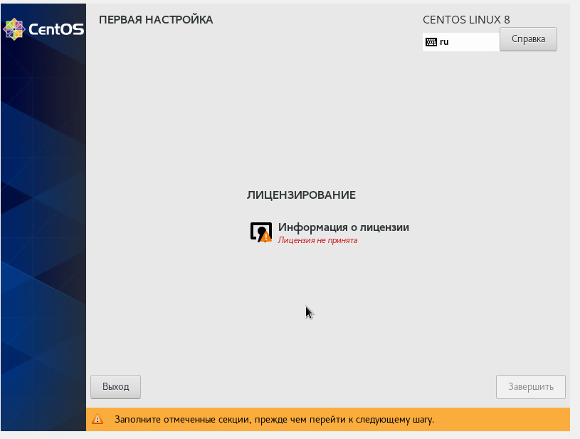

---
# Front matter
title: "Отчет по лабораторной работе номер 1"
author: "Хамбалеев Булат Галимович"

# Generic otions
lang: ru-RU
toc-title: "Содержание"

# Pdf output format
toc: true # Table of contents
toc_depth: 2
lof: true # List of figures
lot: true # List of tables
fontsize: 12pt
linestretch: 1.5
papersize: a4
documentclass: scrreprt
## I18n
polyglossia-lang:
  name: russian
  options:
	- spelling=modern
	- babelshorthands=true
polyglossia-otherlangs:
  name: english
### Fonts
mainfont: Ubuntu
romanfont: Ubuntu
sansfont: Ubuntu
monofont: Ubuntu
mainfontoptions: Ligatures=TeX
romanfontoptions: Ligatures=TeX
sansfontoptions: Ligatures=TeX,Scale=MatchLowercase
monofontoptions: Scale=MatchLowercase,Scale=0.9
## Biblatex
biblatex: true
biblio-style: "gost-numeric"
biblatexoptions:
  - parentracker=true
  - backend=biber
  - hyperref=auto
  - language=auto
  - autolang=other*
  - citestyle=gost-numeric
## Misc options
indent: true
header-includes:
  - \linepenalty=10 # the penalty added to the badness of each line within a paragraph (no associated penalty node) Increasing the value makes tex try to have fewer lines in the paragraph.
  - \interlinepenalty=0 # value of the penalty (node) added after each line of a paragraph.
  - \hyphenpenalty=50 # the penalty for line breaking at an automatically inserted hyphen
  - \exhyphenpenalty=50 # the penalty for line breaking at an explicit hyphen
  - \binoppenalty=700 # the penalty for breaking a line at a binary operator
  - \relpenalty=500 # the penalty for breaking a line at a relation
  - \clubpenalty=150 # extra penalty for breaking after first line of a paragraph
  - \widowpenalty=150 # extra penalty for breaking before last line of a paragraph
  - \displaywidowpenalty=50 # extra penalty for breaking before last line before a display math
  - \brokenpenalty=100 # extra penalty for page breaking after a hyphenated line
  - \predisplaypenalty=10000 # penalty for breaking before a display
  - \postdisplaypenalty=0 # penalty for breaking after a display
  - \floatingpenalty = 20000 # penalty for splitting an insertion (can only be split footnote in standard LaTeX)
  - \raggedbottom # or \flushbottom
  - \usepackage{float} # keep figures where there are in the text
  - \floatplacement{figure}{H} # keep figures where there are in the text
---

# Цель работы

Приобретение практических навыков установки операционной системы на виртуальную машину, настройки минимально необходимых для
дальнейшей работы сервисов.

# Задание

Лабораторная работа подразумевает установку на виртуальную машину VirtualBox операционной системы
Linux, дистрибутив Centos.

# Выполнение работы

1. Запускаем менеджер Oracle VirtualBox менеджер.(рис 1.)

{ #fig:001 width=90% }

2. Создаём новую виртуальную машину, указываем имя, тип и версию ОС. Также указываем создать новый виртуальный жесткий диск, динамический тип 
хранения, указываем количество выделенной оперативной памяти и памяти на жестком диске.(рис.2-7)

{ #fig:002 width=90% }

{ #fig:003 width=90% }

{ #fig:004 width=90% }

{ #fig:005 width=90% }

{ #fig:006 width=90% }

{ #fig:007 width=90% }

3. Настраивам языки, место и время, доступ в сеть, root пароль, имя и пароль пользователя. (рис.8-12)

{ #fig:008 width=90% }

{ #fig:009 width=90% }

{ #fig:010 width=90% }

{ #fig:011 width=90% }

{ #fig:012 width=90% }

4. Уставливаем и перезагружаем систему. (рис 13-14.)

{ #fig:013 width=90% }

{ #fig:014 width=90% }

5. Принимаем лицензионное соглашение. (рис. 15-16)

{ #fig:015 width=90% }

{ #fig:016 width=90% }

6. Стандартный рабочий стол теперь доступен, осталось установить некоторые дополнительные программы.(рис 17-19)

{ #fig:017 width=90% }

{ #fig:018 width=90% }

{ #fig:019 width=90% }

7. Освобождаем жесткий диск и делаем возможным множественное подключение. (рис 20-21)

{ #fig:020 width=90% }

{ #fig:021 width=90% }

# Выводы

Во время выполнения работы я приобрел практические навыки установки операционной системы на виртуальную машину, а также сделал необходимые для дальнейшей работы сервисов настройки.

