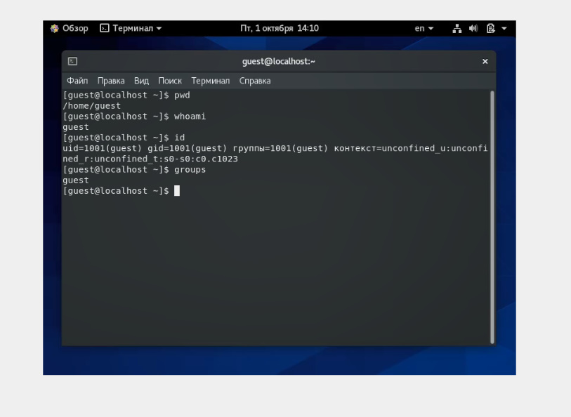
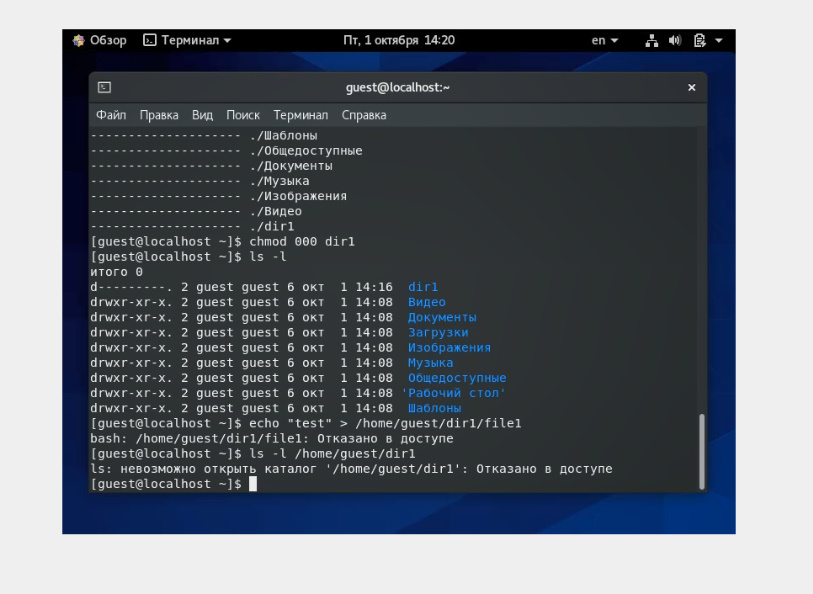
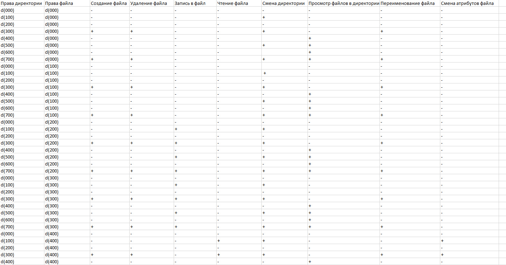
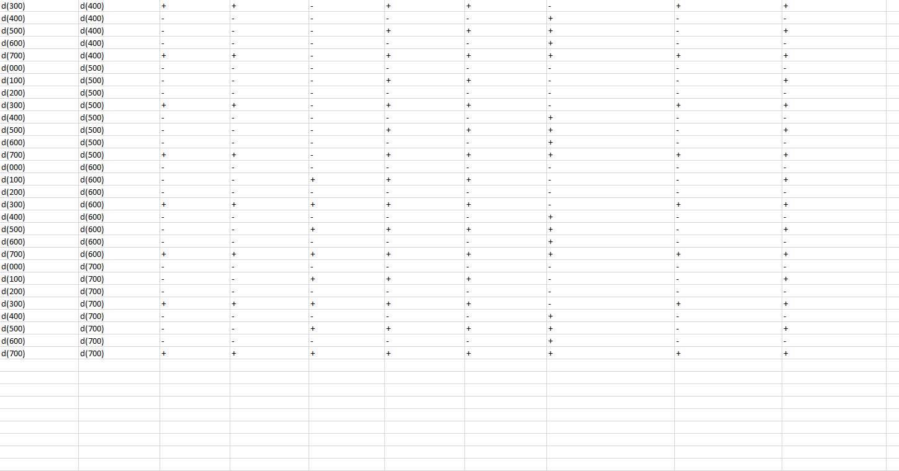
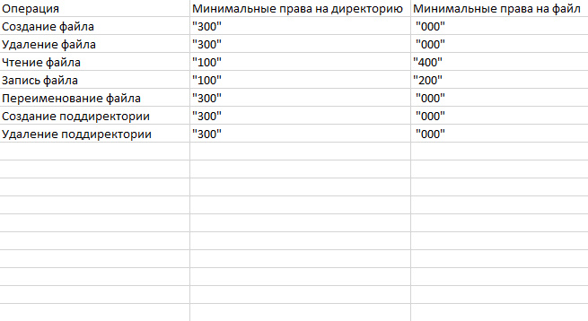

---
## Front matter
lang: ru-RU
title: Отчёт по лабораторной работе 2
author: 'Хамбалеев Булат Галимович'
date: 2 октября, 2021

## Formatting
toc: false
slide_level: 2
theme: metropolis
mainfont: Ubuntu
romanfont: Ubuntu
sansfont: Ubuntu
monofont: Ubuntu
header-includes: 
 - \metroset{progressbar=frametitle,sectionpage=progressbar,numbering=fraction}
 - '\makeatletter'
 - '\beamer@ignorenonframefalse'
 - '\makeatother'
aspectratio: 43
section-titles: true
---

## Цель работы

Получение практических навыков работы в консоли с атрибутами файлов, закрепление теоретических основ 
дискреционного разграничения доступа в современных системах с открытым кодом на базе ОС Linux.

## Задание

Лабораторная работа подразумевает использование некоторых консольных команд для взаимодействия с директориями и 
файлами, а также составление таблицы установленных прав и разрешённых действий.

# Выполнение лабораторной работы

1. Открываю Oracle VirtualBox и включаю виртуальную машину Base. Создаю нового пользователя guest и выбираю для него пароль.

{ #fig:001 width=70% }

---

2. Далее я вспоминаю некоторые команды, такие как id , groups , cat, ls -l.

{ #fig:002 width=70% }

---

3. Далее я вспоминаю команду chmod.

{ #fig:003 width=70% }

---

4. Заполняю таблицу «Установленные права и разрешённые действия», выполняя действия от имени владельца директории (файлов), определив опытным путём, какие операции разрешены, а какие нет.
Если операция разрешена, занешу в таблицу знак «+», если не разрешена, знак «-».

{ #fig:004 width=70% }

---

5. Продолжение предыдущего слайда.

{ #fig:005 width=70% }

---

6. На основании заполненной таблицы определяю те или иные минимально необходимые права для выполнения операций внутри директории
dir1, заполняю таблицу.

{ #fig:006 width=70% }

---

## {.standout}

Спасибо за внимание
