---
# Front matter
title: "Отчет по лабораторной работе номер 2"
author: "Хамбалеев Булат Галимович"

# Generic otions
lang: ru-RU
toc-title: "Содержание"

# Pdf output format
toc: true # Table of contents
toc_depth: 2
lof: true # List of figures
lot: true # List of tables
fontsize: 12pt
linestretch: 1.5
papersize: a4
documentclass: scrreprt
## I18n
polyglossia-lang:
  name: russian
  options:
	- spelling=modern
	- babelshorthands=true
polyglossia-otherlangs:
  name: english
### Fonts
mainfont: Ubuntu
romanfont: Ubuntu
sansfont: Ubuntu
monofont: Ubuntu
mainfontoptions: Ligatures=TeX
romanfontoptions: Ligatures=TeX
sansfontoptions: Ligatures=TeX,Scale=MatchLowercase
monofontoptions: Scale=MatchLowercase,Scale=0.9
## Biblatex
biblatex: true
biblio-style: "gost-numeric"
biblatexoptions:
  - parentracker=true
  - backend=biber
  - hyperref=auto
  - language=auto
  - autolang=other*
  - citestyle=gost-numeric
## Misc options
indent: true
header-includes:
  - \linepenalty=10 # the penalty added to the badness of each line within a paragraph (no associated penalty node) Increasing the value makes tex try to have fewer lines in the paragraph.
  - \interlinepenalty=0 # value of the penalty (node) added after each line of a paragraph.
  - \hyphenpenalty=50 # the penalty for line breaking at an automatically inserted hyphen
  - \exhyphenpenalty=50 # the penalty for line breaking at an explicit hyphen
  - \binoppenalty=700 # the penalty for breaking a line at a binary operator
  - \relpenalty=500 # the penalty for breaking a line at a relation
  - \clubpenalty=150 # extra penalty for breaking after first line of a paragraph
  - \widowpenalty=150 # extra penalty for breaking before last line of a paragraph
  - \displaywidowpenalty=50 # extra penalty for breaking before last line before a display math
  - \brokenpenalty=100 # extra penalty for page breaking after a hyphenated line
  - \predisplaypenalty=10000 # penalty for breaking before a display
  - \postdisplaypenalty=0 # penalty for breaking after a display
  - \floatingpenalty = 20000 # penalty for splitting an insertion (can only be split footnote in standard LaTeX)
  - \raggedbottom # or \flushbottom
  - \usepackage{float} # keep figures where there are in the text
  - \floatplacement{figure}{H} # keep figures where there are in the text
---

# Цель работы

Получение практических навыков работы в консоли с атрибутами файлов, закрепление теоретических основ дискреционного разграничения доступа в современных системах с открытым кодом на базе ОС Linux.

# Задание

Лабораторная работа подразумевает использование некоторых консольных команд для взаимодействия с директориями и файлами, а также составление таблицы установленных прав и разрешённых действий.

# Выполнение работы

1. В установленной при выполнении предыдущей лабораторной работы
операционной системе создаю учётную запись пользователя guest (использую учётную запись администратора) и задаю пароль.(рис 1-2)

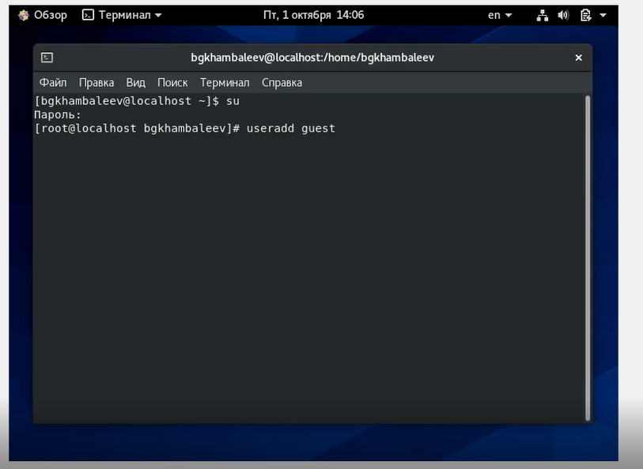{ #fig:001 width=90% }

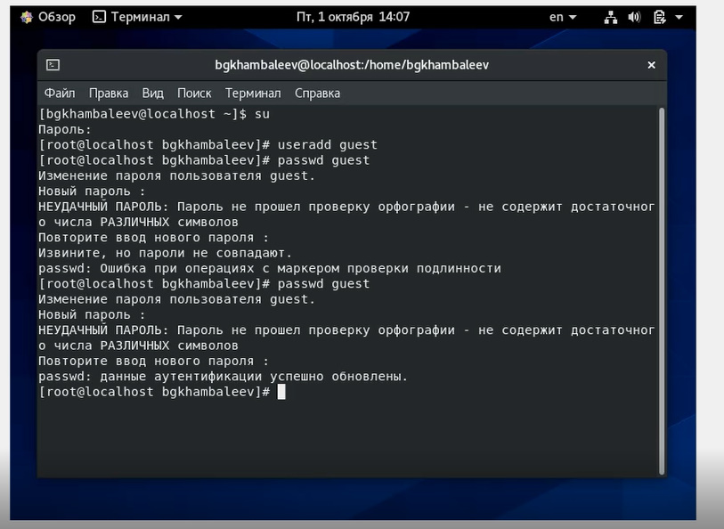{ #fig:002 width=90% }

2. Входим в систему через нового пользователя.(рис.3)

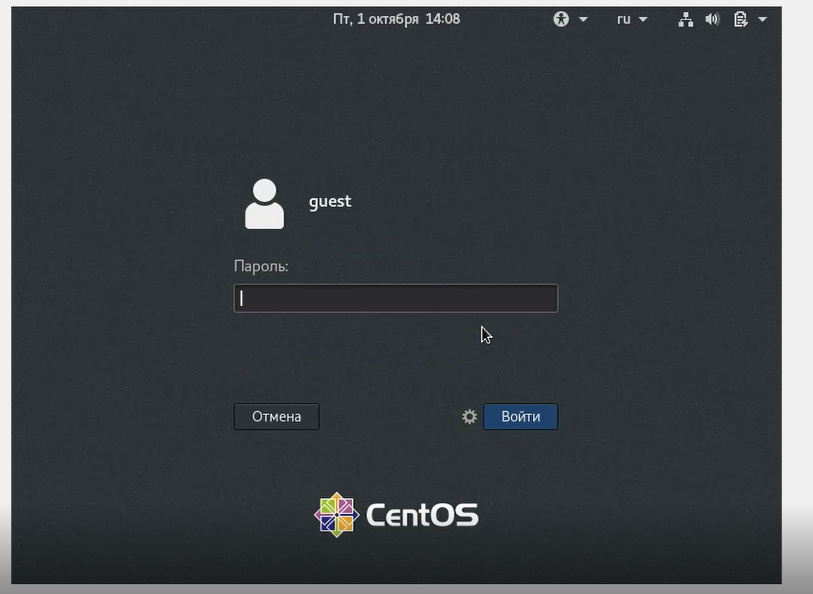{ #fig:003 width=90% }

3. Определяю директорию, в которой нахожусь, командой pwd. Как видно, мы находимся в домашней директории.(рис.4)

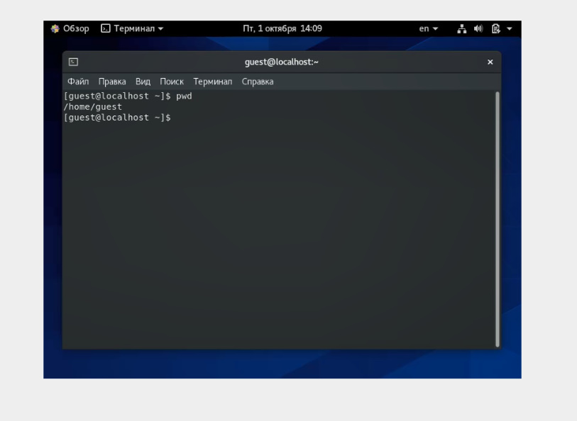{ #fig:004 width=90% }

4. Уточняю имя пользователя командой wnoami. ( рис.5)

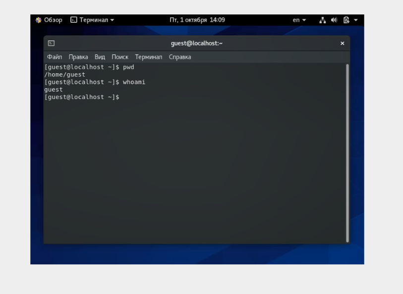{ #fig:005 width=90% }

5. Уточняю имя моего пользователя, его группу, а также группы, куда входит пользователь, командой id. Выведенные значения uid, gid и др. запоминаю. Сравниваю вывод id с выводом команды groups. Команда 
groups выводит группы, в которых состоит пользователь. (рис. 6-7)

{ #fig:006 width=90% }

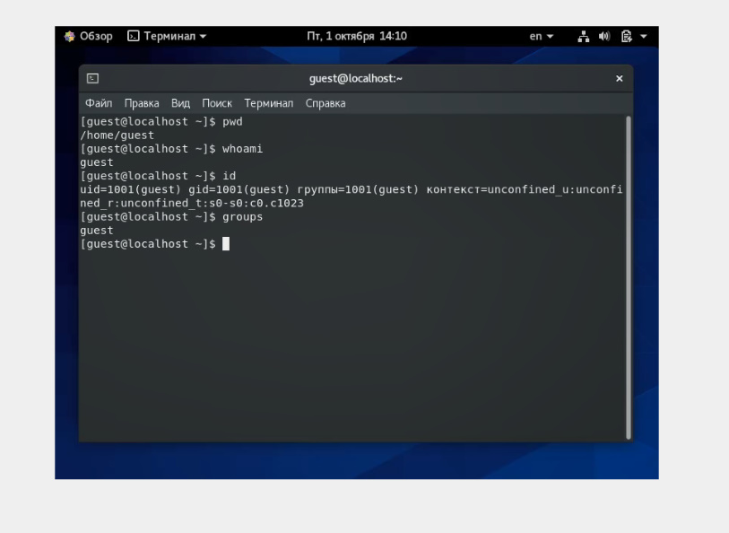{ #fig:007 width=90% }

6. Просмотрите файл /etc/passwd командой cat /etc/passwd.(рис. 8-9) Нахожу свою учетную запись : guest:x:1001:1001::/home/guest:/bin/bash . Запомненные значения совпадают. Uid равен 1001,gid равен 1001.

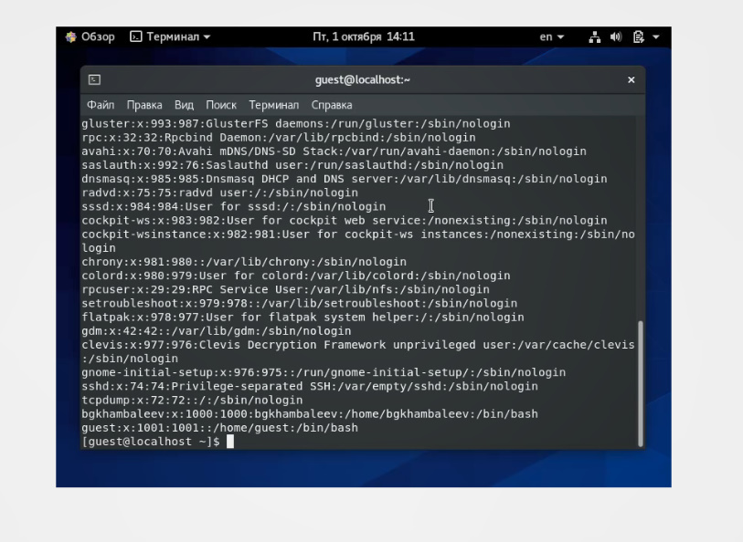{ #fig:008 width=90% }

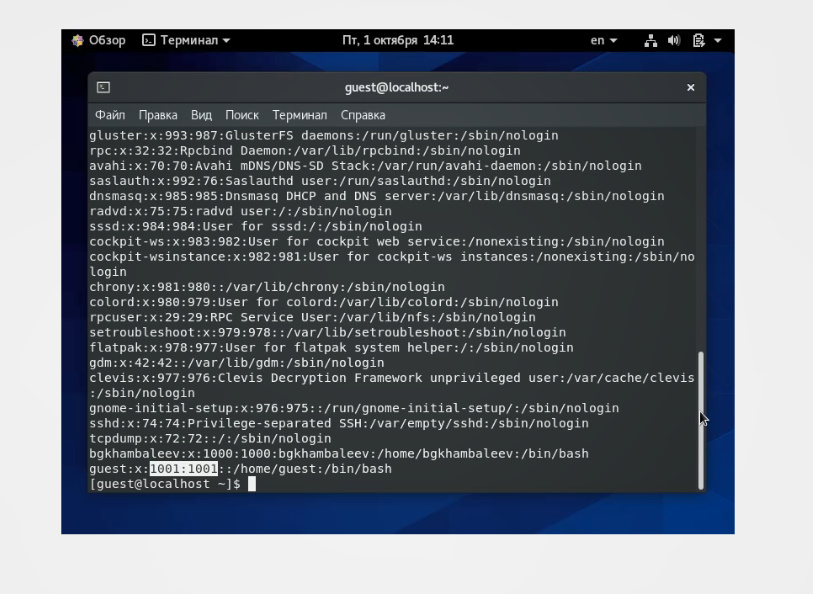{ #fig:009 width=90% }

7. Определяю существующие в системе директории командой ls – l /home/. Мне удалось определить существующие поддиректории директории /home (рис. 10).

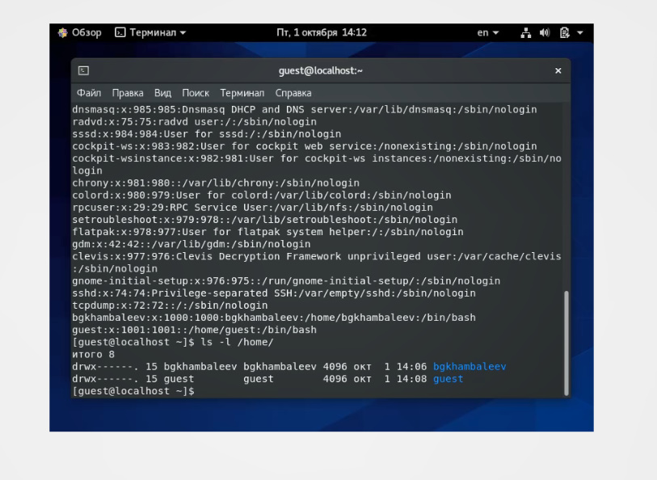{ #fig:010 width=90% }

8. Проверяем, какие расширенные атрибуты установлены на поддиректориях, находящихся в директории /home, командой lsattr /home (рис. 11). В доступе нам отказано.

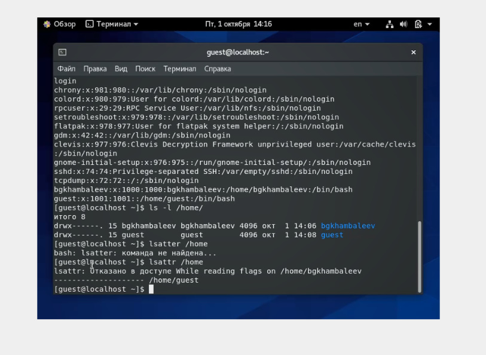{ #fig:011 width=90% }

9. Создаю в домашней директории поддиректорию dir1 командой mkdir dir1. Определяем командами ls -l и lsattr, какие права доступа и расширенные атрибуты были выставлены на директорию dir1. (рис. 12)

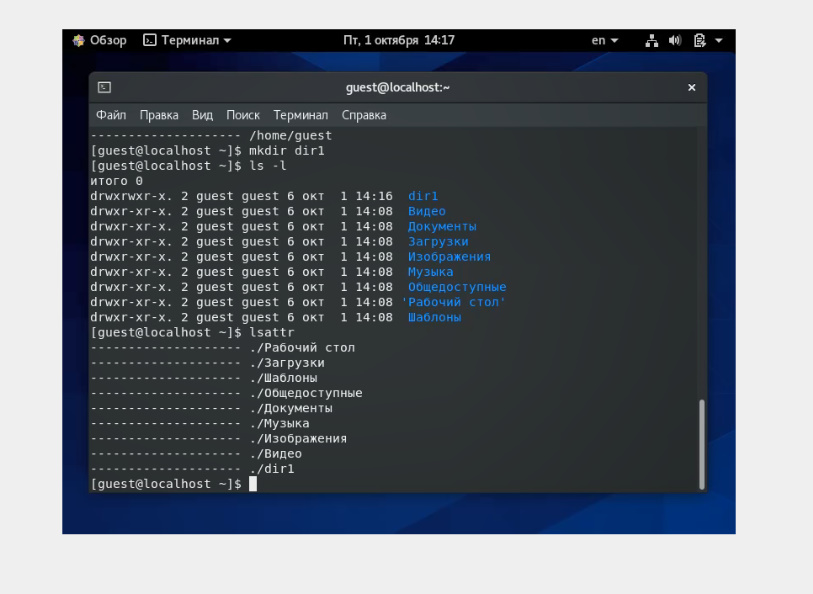{ #fig:012 width=90% }

10. Снимаем с директории dir1 все атрибуты командой chmod 000 dir1 и проверяю с её помощью правильность выполнения команды ls -l. (рис. 13)

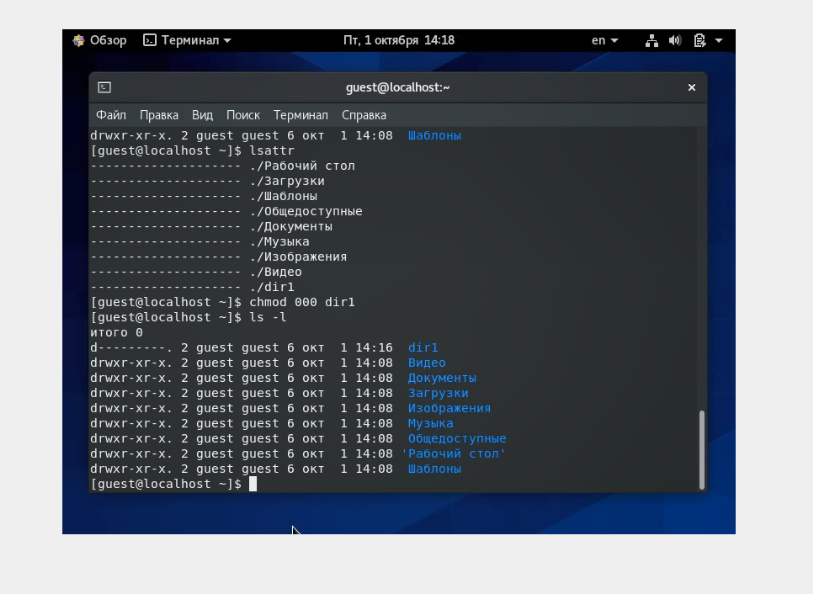{ #fig:013 width=90% }

11. Пытаюсь создать в директории dir1 файл file1 командой echo "test" > /home/guest/dir1/file1. Проверяю командой ls -l /home/guest/dir1 действительно ли файл file1 не
находится внутри директории dir1. Как мы видим, прав для этого у меня недостаточно (рис. 14-15). 

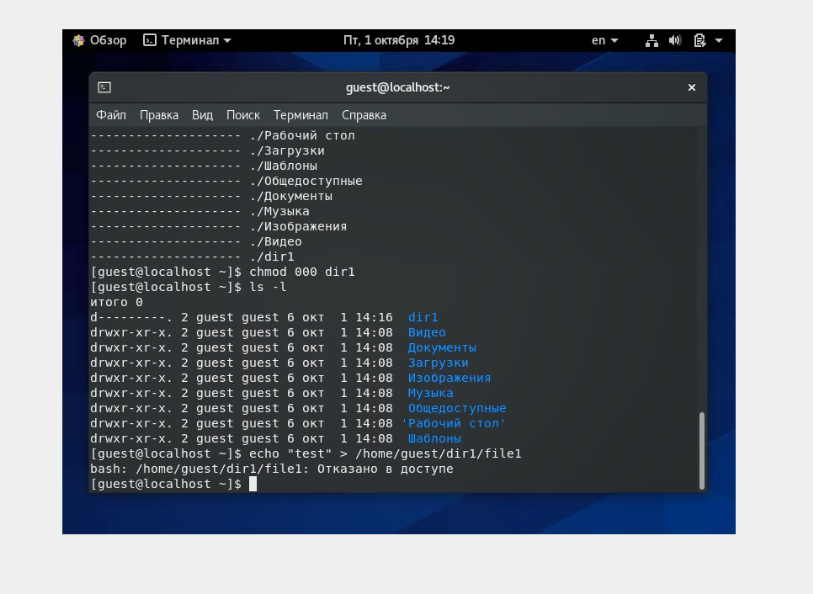{ #fig:014 width=90% }

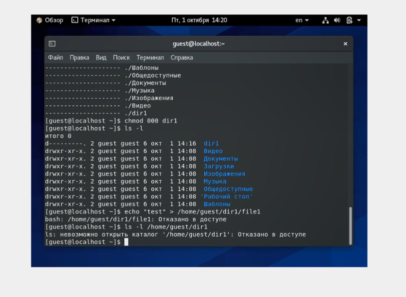{ #fig:015 width=90% }

12. Заполняю таблицу «Установленные права и разрешённые действия», выполняя действия от имени владельца директории (файлов), определив опытным путём, какие операции разрешены, а какие нет.
Если операция разрешена, заношу в таблицу знак «+», если не разрешена, знак «-».

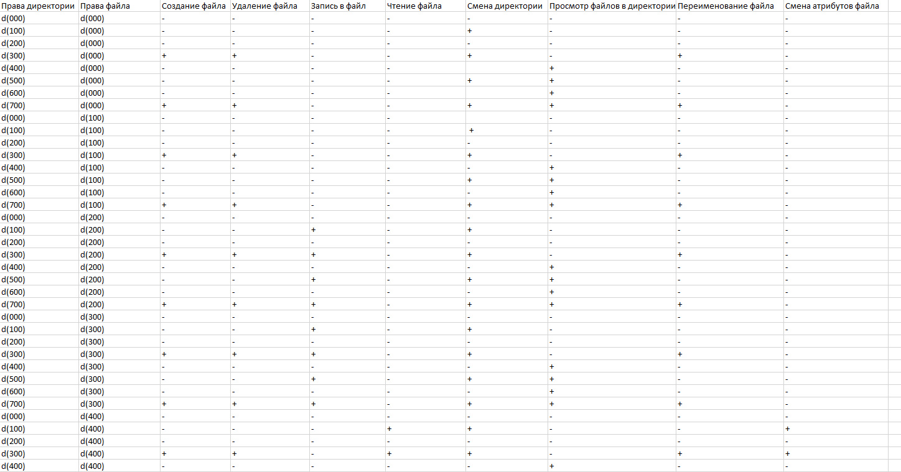{ #fig:016 width=90% }

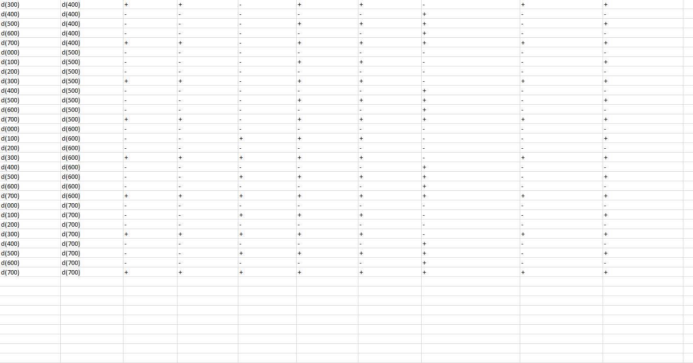{ #fig:017 width=90% }

13. На основании заполненной таблицы определяю те или иные минимально необходимые права для выполнения операций внутри директории
dir1, заполняю таблицу.

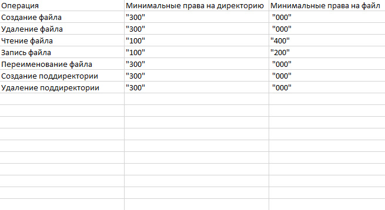{ #fig:018 width=90% }

# Выводы

Во время выполнения лабораторной работы я получил практические навыки работы в консоли с атрибутами файлоы, закрепил основы дискреционного разграничения
доступа в современных системах с открытым кодом на базе OC Linux.

