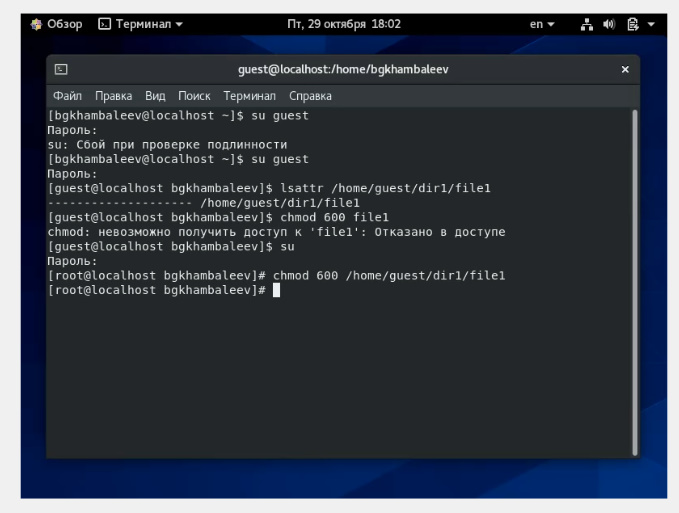
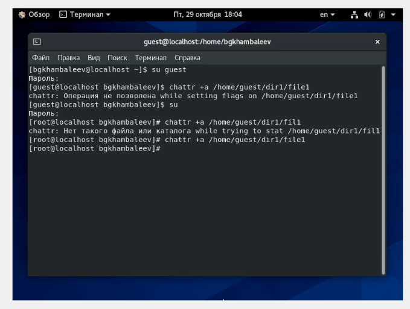
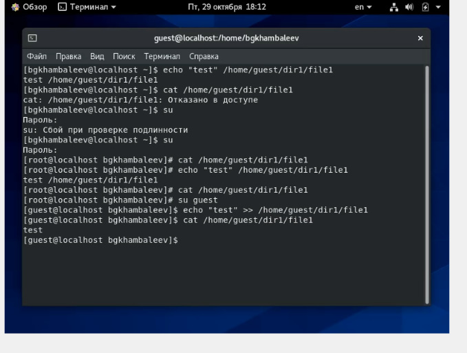
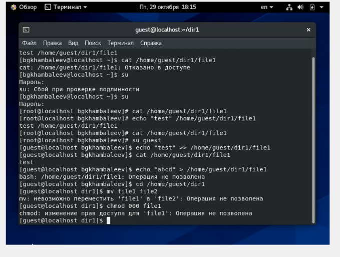
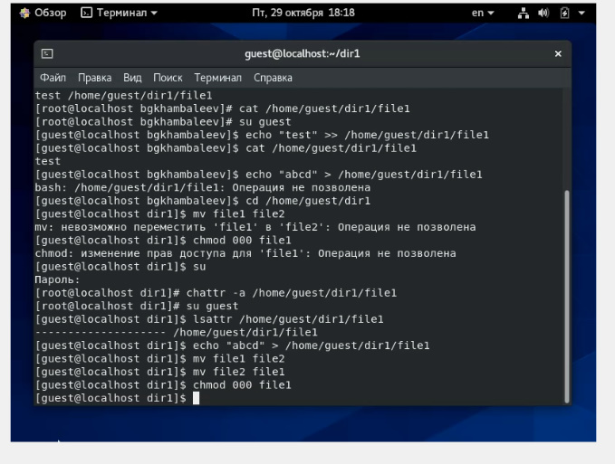
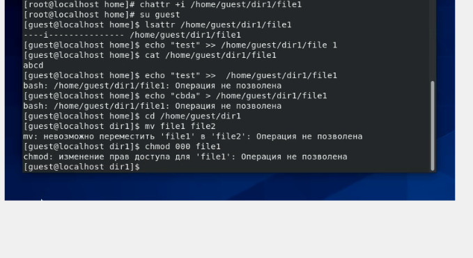

---
## Front matter
lang: ru-RU
title: Отчёт по лабораторной работе 4
author: 'Хамбалеев Булат Галимович'
date: 30 октября, 2021

## Formatting
toc: false
slide_level: 2
theme: metropolis
mainfont: Ubuntu
romanfont: Ubuntu
sansfont: Ubuntu
monofont: Ubuntu
header-includes: 
 - \metroset{progressbar=frametitle,sectionpage=progressbar,numbering=fraction}
 - '\makeatletter'
 - '\beamer@ignorenonframefalse'
 - '\makeatother'
aspectratio: 43
section-titles: true
---

## Цель работы

Получение практических навыков работы в консоли с расширенными атрибутами файлов.

## Задание

Лабораторная работа подразумевает использование некоторых консольных команд для взаимодействия с директориями,файлами и с расширенными атрибутами файлов.

# Выполнение лабораторной работы

1. Открываю Oracle VirtualBox и включаю виртуальную машину Base. Вхожу через профиль guest, проверяю атрибуты файла file1 и использую команду chmod.

{ #fig:001 width=70% }

---

2. Далее я использую команду chattr чтобы присвоить атрибут а файлу file1 .

{ #fig:002 width=70% }

---

3. Далее я вставляю слово test в file1.

{ #fig:003 width=70% }

---

4. Пробую перезаписать file1 и снова изменить права доступа к файлу file1.

{ #fig:004 width=70% }

---

5. Убираю атрибут а и делаю всё то, что раньше не получалось сделать из за ограничений доступа.

{ #fig:005 width=70% }

---

6. Добавляю атрибут i и делаю все действия заново.

{ #fig:006 width=70% }

---

## {.standout}

Спасибо за внимание
