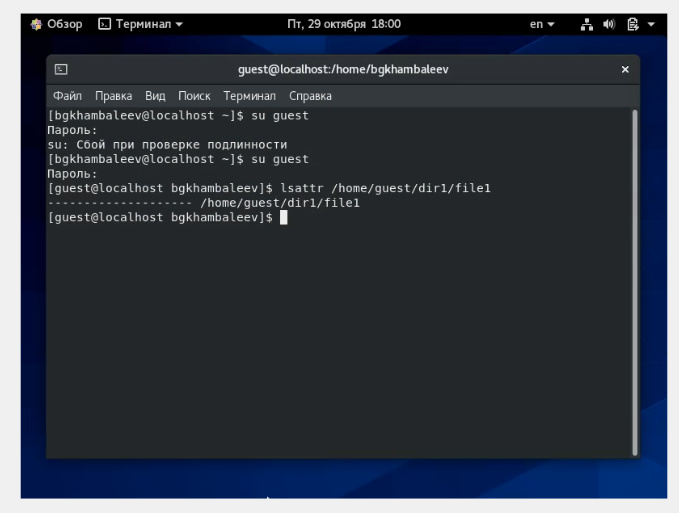
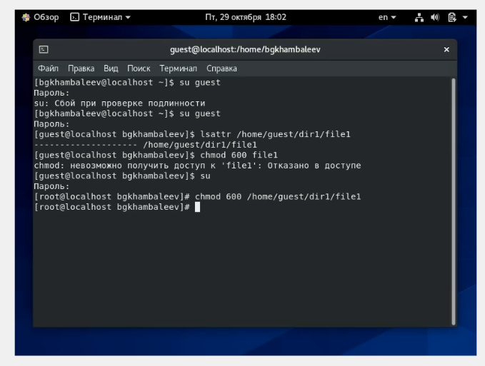
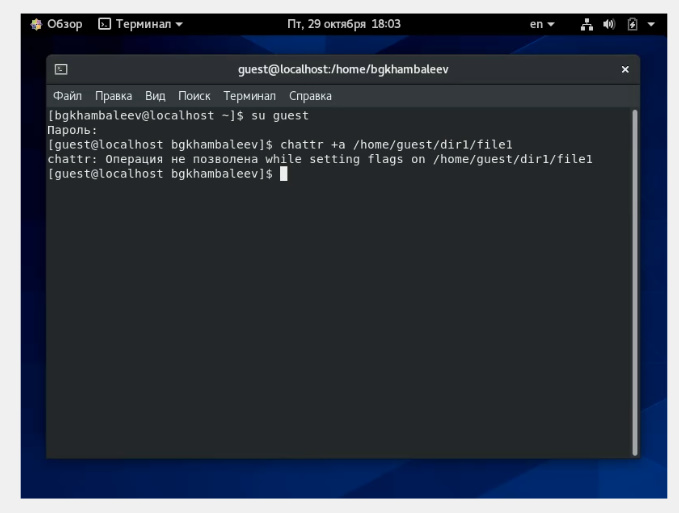
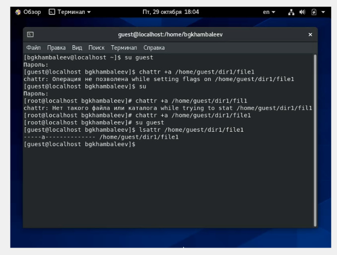
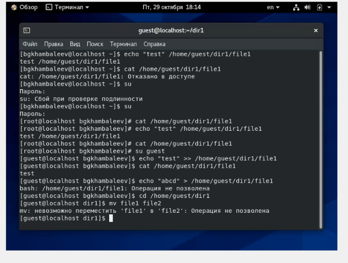

---
# Front matter
title: "Отчет по лабораторной работе номер 4"
author: "Хамбалеев Булат Галимович"

# Generic otions
lang: ru-RU
toc-title: "Содержание"

# Pdf output format
toc: true # Table of contents
toc_depth: 2
lof: true # List of figures
lot: true # List of tables
fontsize: 12pt
linestretch: 1.5
papersize: a4
documentclass: scrreprt
## I18n
polyglossia-lang:
  name: russian
  options:
	- spelling=modern
	- babelshorthands=true
polyglossia-otherlangs:
  name: english
### Fonts
mainfont: Ubuntu
romanfont: Ubuntu
sansfont: Ubuntu
monofont: Ubuntu
mainfontoptions: Ligatures=TeX
romanfontoptions: Ligatures=TeX
sansfontoptions: Ligatures=TeX,Scale=MatchLowercase
monofontoptions: Scale=MatchLowercase,Scale=0.9
## Biblatex
biblatex: true
biblio-style: "gost-numeric"
biblatexoptions:
  - parentracker=true
  - backend=biber
  - hyperref=auto
  - language=auto
  - autolang=other*
  - citestyle=gost-numeric
## Misc options
indent: true
header-includes:
  - \linepenalty=10 # the penalty added to the badness of each line within a paragraph (no associated penalty node) Increasing the value makes tex try to have fewer lines in the paragraph.
  - \interlinepenalty=0 # value of the penalty (node) added after each line of a paragraph.
  - \hyphenpenalty=50 # the penalty for line breaking at an automatically inserted hyphen
  - \exhyphenpenalty=50 # the penalty for line breaking at an explicit hyphen
  - \binoppenalty=700 # the penalty for breaking a line at a binary operator
  - \relpenalty=500 # the penalty for breaking a line at a relation
  - \clubpenalty=150 # extra penalty for breaking after first line of a paragraph
  - \widowpenalty=150 # extra penalty for breaking before last line of a paragraph
  - \displaywidowpenalty=50 # extra penalty for breaking before last line before a display math
  - \brokenpenalty=100 # extra penalty for page breaking after a hyphenated line
  - \predisplaypenalty=10000 # penalty for breaking before a display
  - \postdisplaypenalty=0 # penalty for breaking after a display
  - \floatingpenalty = 20000 # penalty for splitting an insertion (can only be split footnote in standard LaTeX)
  - \raggedbottom # or \flushbottom
  - \usepackage{float} # keep figures where there are in the text
  - \floatplacement{figure}{H} # keep figures where there are in the text
---

# Цель работы

Получение практических навыков работы в консоли с расширенными атрибутами файлов.

# Задание

Лабораторная работа подразумевает использование некоторых консольных команд для взаимодействия с директориями,файлами и с расширенными атрибутами файлов.

# Теория

Команда chattr — изменяет атрибуты файлов на файловых системах ext2fs, ext3, ext4 и частично на других файловых системах Linux.

Формат символьного режима:  +-=[acdeijstuACDST]. «+» обозначает добавление указанных атрибутов к существующим; «-» обозначает их снятие; «=» обозначает установку только этих атрибутов файлам.

Команда lsattr помогает увидеть расширенные атрибуты файла.

# Выполнение работы

1. От имени пользователя guest определяю расширенные атрибуты файла file1.(рис 1)

{ #fig:001 width=90% }

2. Устанавливаю командой chmod 600 file1 на файл file1 права, разрешающие чтение и запись для владельца файла.(рис.2)

{ #fig:002 width=90% }

3. Попробовал установить на файл /home/guest/dir1/file1 расширенный атрибут a от имени пользователя guest. В доступе отказано.(рис.3)

{ #fig:003 width=90% }

4. Попробовал установить расширенный атрибут a на файл /home/guest/dir1/file1 от имени суперпользователя:. ( рис.4)

{ #fig:004 width=90% }

5. От пользователя guest проверил правильность установления атрибута. Все сходится. (рис. 5)

{ #fig:005 width=90% }

6. Выполнил дозапись в файл file1 слова «test» командой echo "test" /home/guest/dir1/file1. После этого выполнил чтение файла командой cat /home/guest/dir1/file1. (рис. 6)

{ #fig:006 width=90% }

7. Попробовал стереть имеющуюся в file1 информацию командой echo "abcd" > /home/guest/dirl/file1. В доступе отказано. В переименовании тоже отказано.(рис. 7).

{ #fig:007 width=90% }

8.Попробовал с помощью команды chmod 000 file1 установить на файл file1 права, например, запрещающие чтение и запись для владельца файла. В доступе отказано.(рис. 8).

{ #fig:008 width=90% }

9. Снял расширенный атрибут a с файла /home/guest/dirl/file1 от имени суперпользователя командой chattr -a /home/guest/dir1/file1. Повторил операции, которые ранее не удавалось выполнить. Теперь во всех операциях доступ разрешён. (рис. 9)

{ #fig:009 width=90% }

10. Повторил действия по шагам, заменив атрибут «a» атрибутом «i». Дозаписать текст в файл не удалось. (рис. 10)

{ #fig:010 width=90% }

# Библиография

1. ТУИС РУДН

2. Статья на сайте "https://linux-notes.org/izmenenie-atributov-flagov-na-fajlah-v-unix-linux/"

# Выводы

Во время выполнения лабораторной работы я получил практические навыки работы в консоли с расширенными атрибутами файлов.

