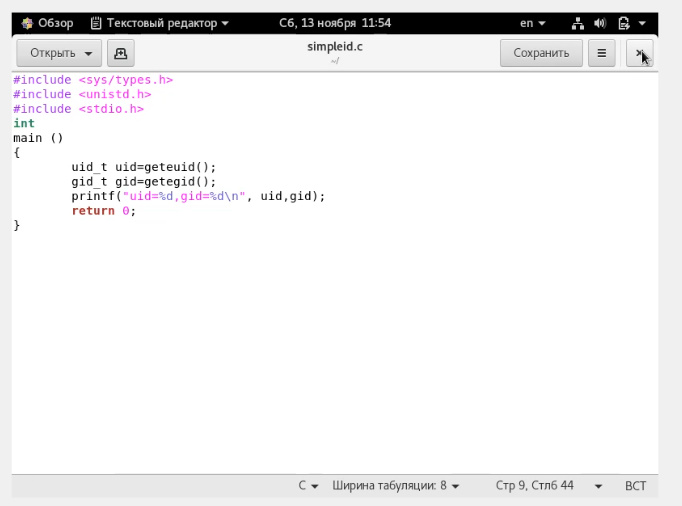
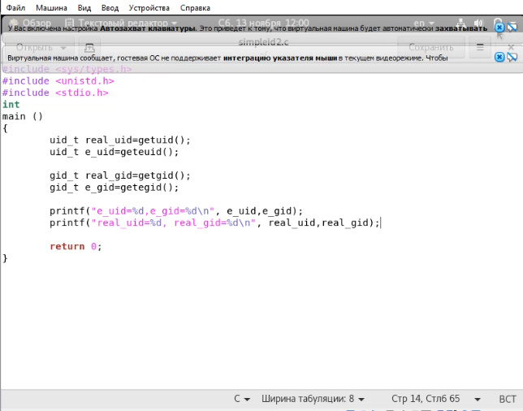
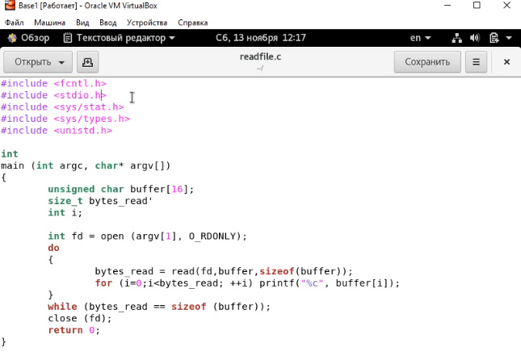
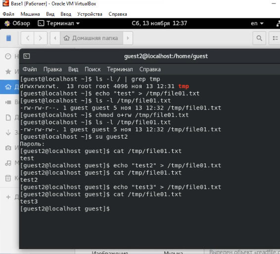
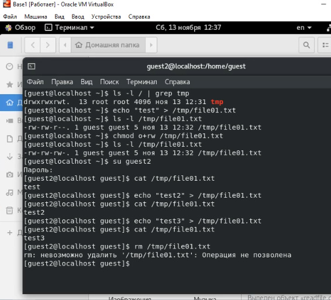
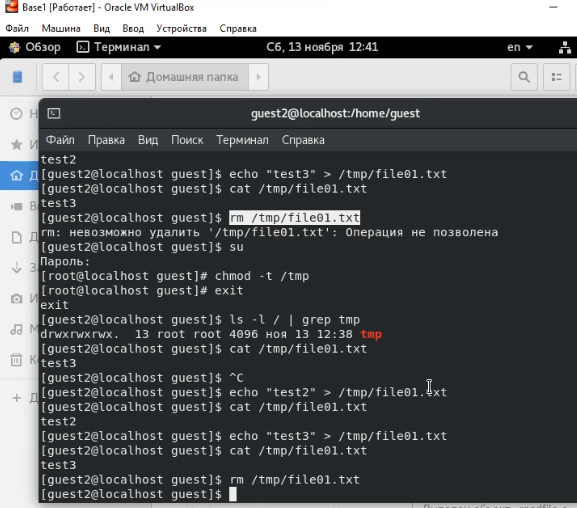

---
## Front matter
lang: ru-RU
title: Отчёт по лабораторной работе 5
author: 'Хамбалеев Булат Галимович'
date: 13 ноября, 2021

## Formatting
toc: false
slide_level: 2
theme: metropolis
mainfont: Ubuntu
romanfont: Ubuntu
sansfont: Ubuntu
monofont: Ubuntu
header-includes: 
 - \metroset{progressbar=frametitle,sectionpage=progressbar,numbering=fraction}
 - '\makeatletter'
 - '\beamer@ignorenonframefalse'
 - '\makeatother'
aspectratio: 43
section-titles: true
---

## Цель работы

Изучение механизмов изменения идентификаторов, применения SetUID- и Sticky-битов. Получение практических навыков работы в консоли с дополнительными атрибутами. Рассмотрение работы механизма смены идентификатора процессов пользователей, а также влияние бита Sticky на запись и удаление файлов.

## Задание

Лабораторная работа подразумевает использование некоторых консольных команд для взаимодействия с кодом, правами и атрибутами.

# Выполнение лабораторной работы

1. Открываю Oracle VirtualBox и включаю виртуальную машину Base. Вхожу через профиль guest, создаю программу simpleid. Результаты выполнения сходятся.

{ #fig:001 width=70% }

---

2. Далее я создаю усложнённую программу, добавив вывод действительных идентификаторов. Результаты выполнения сходятся.

{ #fig:002 width=70% }

---

3. Далее я создаю программу readfile.c, и делаю некоторые действия связанные с чтением и правами.

{ #fig:003 width=70% }

---

4. Далее, создав новый файл, я пробую разные способы записи в файл.

{ #fig:004 width=70% }

---

5. Далее пытаюсь удалить файл, но доступ запрещен.

{ #fig:005 width=70% }

---

6. Пробую те же действия без атрибута t, теперь удаление доступно.

{ #fig:006 width=70% }

---

## {.standout}

Спасибо за внимание
