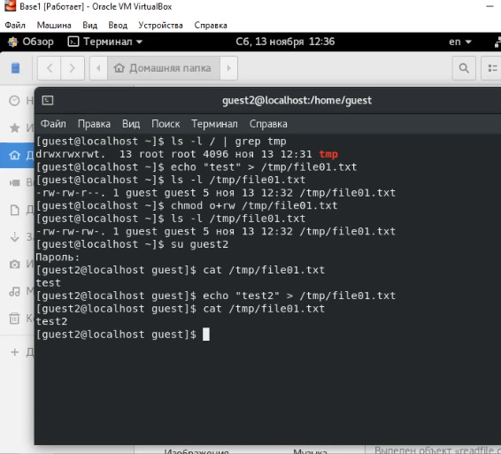

---
# Front matter
title: "Отчет по лабораторной работе номер 5"
author: "Хамбалеев Булат Галимович"

# Generic otions
lang: ru-RU
toc-title: "Содержание"

# Pdf output format
toc: true # Table of contents
toc_depth: 2
lof: true # List of figures
lot: true # List of tables
fontsize: 12pt
linestretch: 1.5
papersize: a4
documentclass: scrreprt
## I18n
polyglossia-lang:
  name: russian
  options:
	- spelling=modern
	- babelshorthands=true
polyglossia-otherlangs:
  name: english
### Fonts
mainfont: Ubuntu
romanfont: Ubuntu
sansfont: Ubuntu
monofont: Ubuntu
mainfontoptions: Ligatures=TeX
romanfontoptions: Ligatures=TeX
sansfontoptions: Ligatures=TeX,Scale=MatchLowercase
monofontoptions: Scale=MatchLowercase,Scale=0.9
## Biblatex
biblatex: true
biblio-style: "gost-numeric"
biblatexoptions:
  - parentracker=true
  - backend=biber
  - hyperref=auto
  - language=auto
  - autolang=other*
  - citestyle=gost-numeric
## Misc options
indent: true
header-includes:
  - \linepenalty=10 # the penalty added to the badness of each line within a paragraph (no associated penalty node) Increasing the value makes tex try to have fewer lines in the paragraph.
  - \interlinepenalty=0 # value of the penalty (node) added after each line of a paragraph.
  - \hyphenpenalty=50 # the penalty for line breaking at an automatically inserted hyphen
  - \exhyphenpenalty=50 # the penalty for line breaking at an explicit hyphen
  - \binoppenalty=700 # the penalty for breaking a line at a binary operator
  - \relpenalty=500 # the penalty for breaking a line at a relation
  - \clubpenalty=150 # extra penalty for breaking after first line of a paragraph
  - \widowpenalty=150 # extra penalty for breaking before last line of a paragraph
  - \displaywidowpenalty=50 # extra penalty for breaking before last line before a display math
  - \brokenpenalty=100 # extra penalty for page breaking after a hyphenated line
  - \predisplaypenalty=10000 # penalty for breaking before a display
  - \postdisplaypenalty=0 # penalty for breaking after a display
  - \floatingpenalty = 20000 # penalty for splitting an insertion (can only be split footnote in standard LaTeX)
  - \raggedbottom # or \flushbottom
  - \usepackage{float} # keep figures where there are in the text
  - \floatplacement{figure}{H} # keep figures where there are in the text
---

# Цель работы

Изучение механизмов изменения идентификаторов, применения SetUID- и Sticky-битов. Получение практических навыков работы в консоли с дополнительными атрибутами. Рассмотрение работы механизма смены идентификатора процессов пользователей, а также влияние бита Sticky на запись и удаление файлов.

# Задание

Лабораторная работа подразумевает использование некоторых консольных команд для взаимодействия с кодом, правами и атрибутами.

# Теория

Setuid и setgid являются флагами прав доступа в Unix, которые разрешают пользователям запускать исполняемые файлы с правами владельца или группы исполняемого файла. Sticky bit — дополнительный атрибут файлов или каталогов в операционных системах семейства UNIX.

# Выполнение работы

1. Войдём в систему от имени пользователя guest. Создадим программу simpleid.c . Скомпилируем её и затем выполним. Затем выполним id.(рис 1-4)

{ #fig:001 width=90% }

{ #fig:002 width=90% }

{ #fig:003 width=90% }

{ #fig:004 width=90% }

2. Усложним программу, добавив вывод действительных идентификаторов. Назовём программу simpleid2. Cкомпилируем и запустим. От имени суперпользователя выполним следующие команды: chown root:guest /home/guest/simpleid2 chmod u+s /home/guest/simpleid2 . Повысим права с помощью su. Выполним проверку правильности установки атрибутов и смены владельца файла simpleid2. (рис.5-8)

{ #fig:005 width=90% }

{ #fig:006 width=90% }

{ #fig:007 width=90% }

{ #fig:008 width=90% }

3. Запустил simpleid2 и id. Проделал тоже самое относительно SetGID-бита Создал программу readfile.c . Откомпилировал её. Сменил владельца файла readfile.c . Проверил, что пользователь guest не может прочитать файл readfile.c . Сменил у программы redfile владельца и установил SetU'D-бит.(рис.9-13)

{ #fig:009 width=90% }

{ #fig:010 width=90% }

{ #fig:011 width=90% }

{ #fig:012 width=90% }

{ #fig:013 width=90% }

4. Проверил , может ли программа readfile прочитать файл readfile.c . Может.  Проверил может ли программа readfile.c прочитать файл /etc/shadow . Может.( рис.14-17)

{ #fig:014 width=90% }

{ #fig:015 width=90% }

{ #fig:016 width=90% }

{ #fig:017 width=90% }

5. Выяснил установлен ли атрибут Sticky на директории /tmp. Создал файл file01.txt со словом test. Разрешил чтение и запись для категории пользователей "все остальные". Попробовал прочитать file01.txt от пользователя guest2. От пользователя guest2 попробовал дозаписать в файл file01.txt слово test2. (рис. 18-22)

{ #fig:018 width=90% }

{ #fig:019 width=90% }

{ #fig:020 width=90% }

{ #fig:021 width=90% }

{ #fig:022 width=90% }

6. Проверил содержимое файла командой. Попробовал записать test3 в файл от имени guest2. От пользователя guest2 попробовал удалить файл file01.txt. Удалить не удалось. Повысил права до суперпользователя и снял атрибут t. (рис. 23-27)

{ #fig:023 width=90% }

{ #fig:024 width=90% }

{ #fig:025 width=90% }

{ #fig:026 width=90% }

{ #fig:027 width=90% }

7. Покинул режим суперпользователя командой exit. Проверил наличие атрибута t. Повторил предыдущие шаги, на этот раз получилось удалить файл. Повысил свои права до суперпользователя и вернул атрибут t на директорию /tmp.(рис. 28-30).

{ #fig:028 width=90% }

{ #fig:029 width=90% }

{ #fig:030 width=90% }

# Библиография

1. ТУИС РУДН

2. Статья на сайте "https://ru.wikipedia.org/wiki/Sticky_bit"

3. Статья на сайте "https://ru.wikipedia.org/wiki/Suid"

# Выводы

Во время выполнения лабораторной работы я получил практические навыки работы в консоли с дополнительными атрибутами. Рассмотрел работы механизма смены идентификаторов процессов пользователей. Изучил механизмы изменения идентификаторов.

