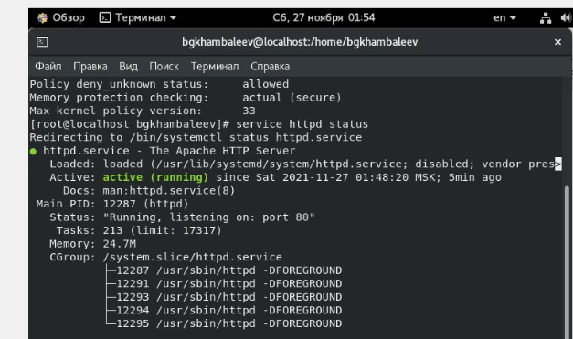
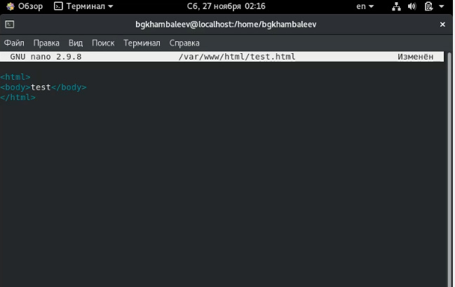
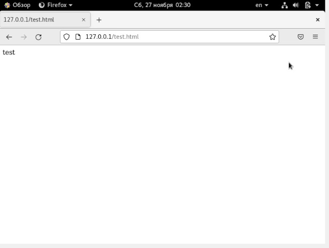
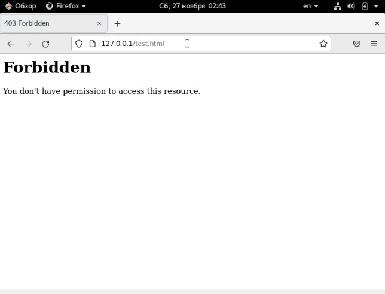
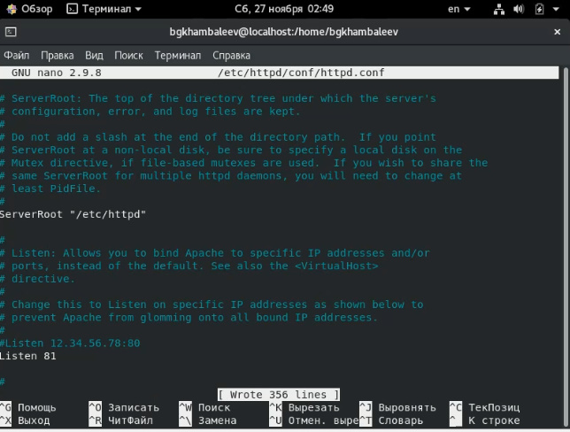
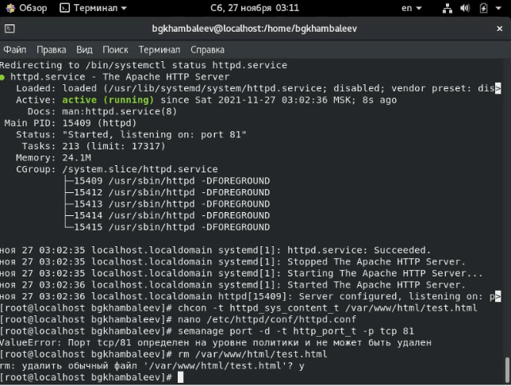

---
## Front matter
lang: ru-RU
title: Отчёт по лабораторной работе 6
author: 'Хамбалеев Булат Галимович'
date: 27 ноября, 2021

## Formatting
toc: false
slide_level: 2
theme: metropolis
mainfont: Ubuntu
romanfont: Ubuntu
sansfont: Ubuntu
monofont: Ubuntu
header-includes: 
 - \metroset{progressbar=frametitle,sectionpage=progressbar,numbering=fraction}
 - '\makeatletter'
 - '\beamer@ignorenonframefalse'
 - '\makeatother'
aspectratio: 43
section-titles: true
---

## Цель работы

Развить навыки администрирования ОС Linux. Получить первое практическое знакомство с технологией SELinux1. Проверить работу SELinx на практике совместно с веб-сервером Apache.

## Задание

Лабораторная работа подразумевает использование некоторых консольных команд для взаимодействия с кодом и веб-сервером.

# Выполнение лабораторной работы

1. Запускаем веб-сервер Apache и проверяем её статус.

{ #fig:001 width=70% }

---

2. От имени суперпользователя создаём html файл для нашего веб-сервера.

{ #fig:002 width=70% }

---

3. Как мы видим, веб-сервер работает.

{ #fig:003 width=70% }

---

4. Изменим контекст файла на недоступный и увидим результат.

{ #fig:004 width=70% }

---

5. Попробуем изменить порт с 80 на 81.

{ #fig:005 width=70% }

---

6. Удалим привязку к порту и сам файл.

{ #fig:006 width=70% }

---

## {.standout}

Спасибо за внимание
